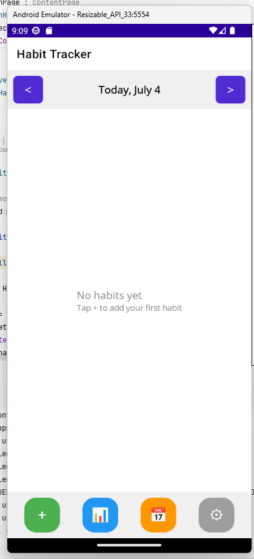
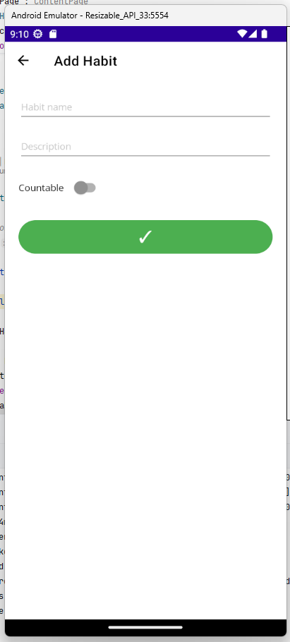
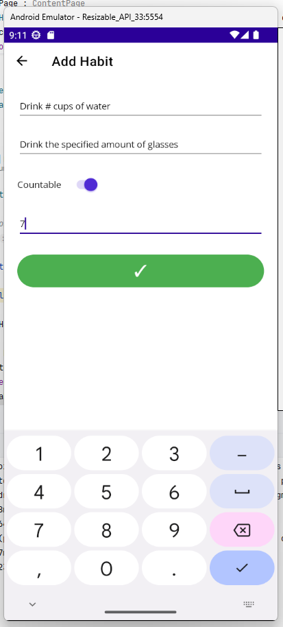
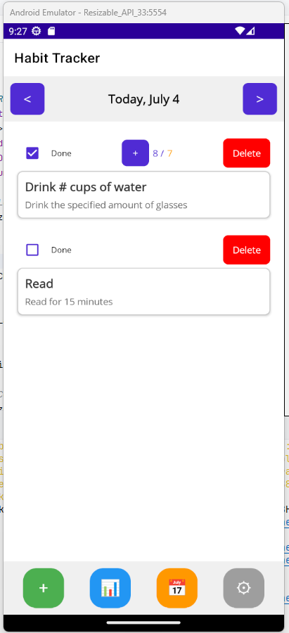
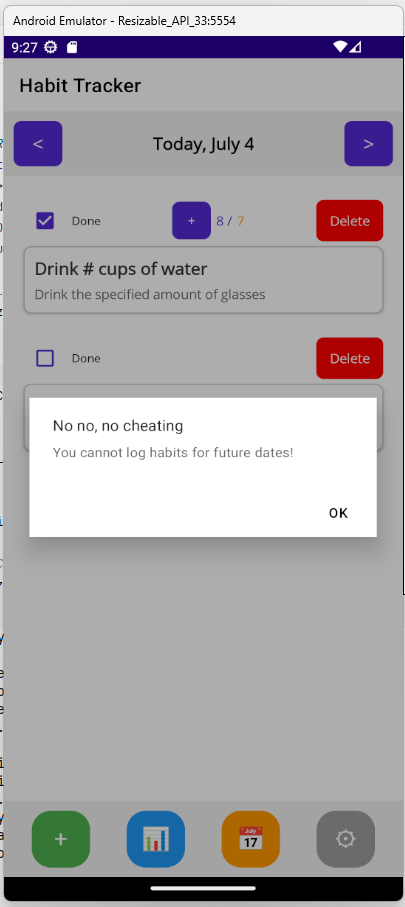
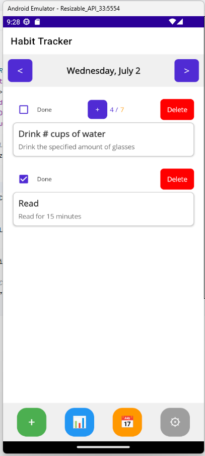
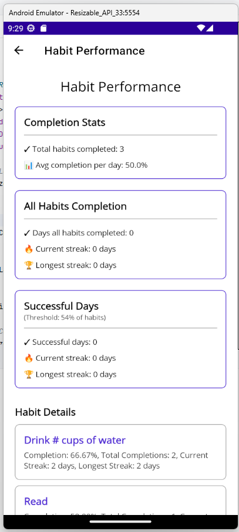
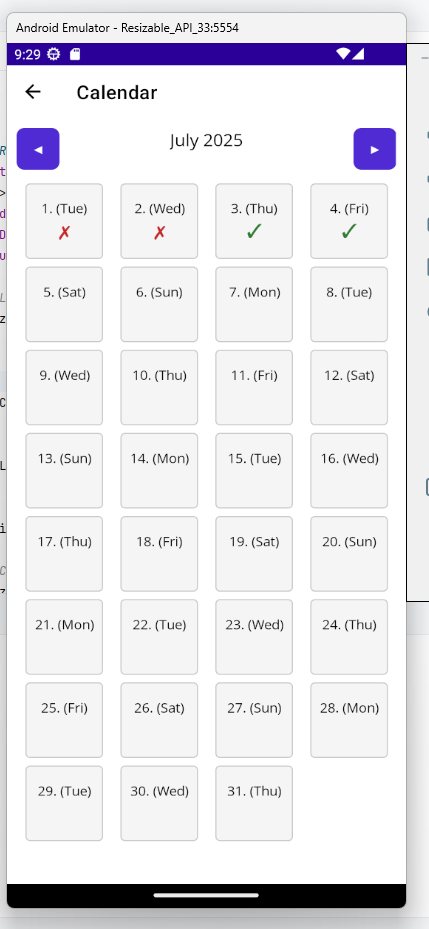
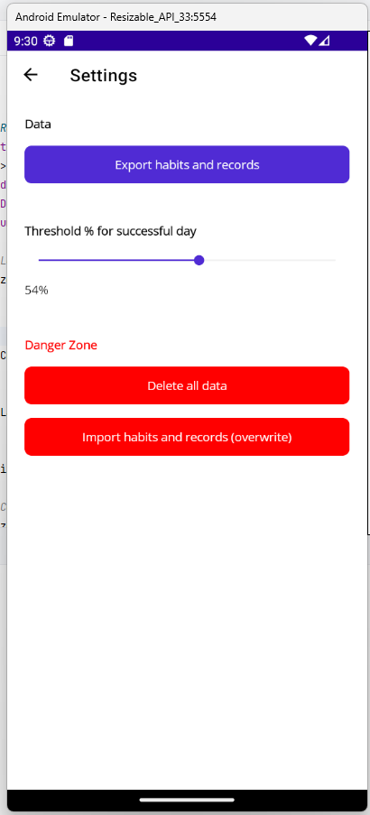

# Habit Tracker App



A modern, cross-platform habit tracking application built with .NET MAUI that helps you build and maintain good habits. Track your daily progress, monitor your streaks, and achieve your goals with an intuitive and beautiful interface.

## Features

- **Habit Management**: Create, edit, and track both simple and countable habits
- **Daily Tracking**: Mark habits as completed or track progress throughout the day
- **Visual Progress**: Clear visual indicators for habit completion and progress
- **Countable Habits**: Track habits with numerical targets (e.g., "Drink 8 glasses of water")
- **Date Navigation**: Easily navigate between days to track or update your progress
- **Responsive Design**: Works on mobile, tablet, and desktop devices
- **Dark/Light Theme**: Automatically adapts to system theme preferences

## Showcase

<div style="display: flex; flex-wrap: wrap; gap: 15px; justify-content: center;">
  
  
  
  
  
  
  
  
</div>

## Technology Stack

- **.NET MAUI**: Cross-platform UI framework
- **C#**: Primary programming language
- **SQLite**: Local database for data persistence
- **MVVM**: Model-View-ViewModel architecture pattern
- **XAML**: UI markup language

## Getting Started

### Prerequisites

- [.NET 8.0 SDK](https://dotnet.microsoft.com/download/dotnet/8.0) or later
- Visual Studio 2022 with .NET MAUI workload or Visual Studio Code with C# Dev Kit
- Android/iOS/Windows development environment (depending on target platform)

### Installation

1. Clone the repository:
   ```bash
   git clone https://github.com/yourusername/MikeNet8HabitsApp.git
   cd MikeNet8HabitsApp
   ```

2. Restore NuGet packages:
   ```bash
   dotnet restore
   ```

3. Build and run the application:
   ```bash
   dotnet build -t:Run -f net8.0-android
   ```
   (Replace `net8.0-android` with your target framework if different)


4. build production for android
   ```bash
   dotnet publish -f:net8.0-android -c:Release -p:PackageFormat=apk
   ```

## Usage

1. **Adding a Habit**:
   - Tap the "+" button in the main screen
   - Enter habit details (name, description, type, target count if applicable)
   - Save to add to your habit list

2. **Tracking Progress**:
   - Tap the checkbox to mark a habit as completed
   - For countable habits, use the "+" button to increment your progress
   - View your daily progress at a glance

3. **Navigating Dates**:
   - Use the arrow buttons to switch between days
   - View your historical progress in the calendar view

## Project Structure

```
MikeNet8HabitsApp/
├── Classes/               # Core domain models
│   ├── Habit.cs          # Habit model with tracking logic
│   └── HabitRecord.cs    # Daily record of habit completion
├── Pages/                # Application pages
│   ├── AddHabitPage.xaml # Add/Edit habit interface
│   ├── CalendarPage.xaml # Calendar view
│   └── ...
├── Services/             # Business logic and data access
│   ├── DatabaseService.cs# SQLite database operations
│   └── SettingsService.cs# Application settings
├── ViewModels/           # ViewModels for MVVM pattern
├── App.xaml              # Application resources
├── MainPage.xaml         # Main application screen
└── MauiProgram.cs        # Application entry point
```

## Contributing

Contributions are welcome! Please feel free to submit a Pull Request.

1. Fork the repository
2. Create your feature branch (`git checkout -b feature/AmazingFeature`)
3. Commit your changes (`git commit -m 'Add some AmazingFeature'`)
4. Push to the branch (`git push origin feature/AmazingFeature`)
5. Open a Pull Request

## License

This project is licensed under the MIT License - see the [LICENSE](LICENSE) file for details.

## Acknowledgments

- Built with ❤️ using .NET MAUI
- Inspired by popular habit tracking methodologies
- Icons by [Material Design Icons](https://materialdesignicons.com/)

---

<div align="center">
  Made with :heart: by Mike (Gangster name for Miha)
</div>
